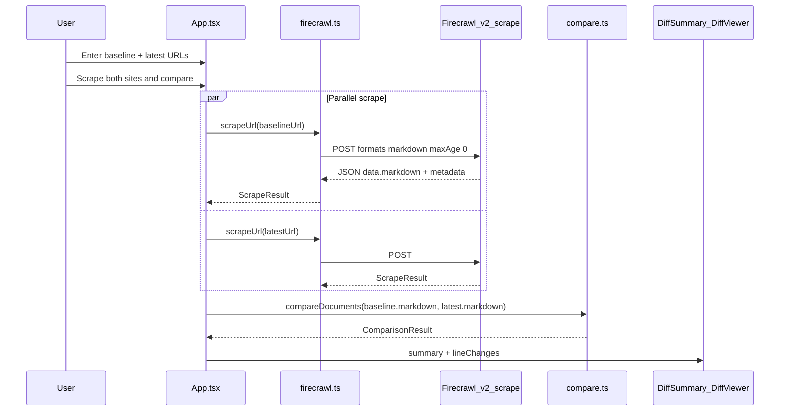

# Tax Rule Change Comparator (POC)

React app that scrapes **two web pages** with [Firecrawl](https://firecrawl.dev), compares the returned **markdown** line-by-line, and shows what the latest document adds, removes, or overrides relative to the baseline. No custom backend—only the browser and the Firecrawl API.

## Table of contents

1. [Overview](#overview)
2. [Quick start](#quick-start)
3. [How it works](#how-it-works)
4. [Scrape: request and response format](#scrape-request-and-response-format)
5. [Comparison: algorithm and output types](#comparison-algorithm-and-output-types)
6. [Project structure](#project-structure)
7. [Limitations and next steps](#limitations-and-next-steps)
8. [Security and build](#security-and-build)

---

## Overview

Typical use case: compare two versions of tax or policy rules (e.g. income tax 2025 vs 2026) from different URLs.

| Step | What happens |
|------|----------------|
| 1 | User enters a **baseline** URL (older rules) and a **latest** URL (newer rules). |
| 2 | App calls Firecrawl **twice** in parallel (`POST /v2/scrape`). |
| 3 | Each response yields a **markdown** string plus metadata. |
| 4 | App runs a **line diff** on the two markdown strings (client-side). |
| 5 | UI shows counts, highlights, and a line-by-line diff viewer. |

Nothing is pre-loaded or static. Results appear only after a successful live scrape.

---

## Quick start

```bash
cd tax-rule-compare
cp .env.example .env.local   # add your Firecrawl API key
npm install
npm run dev
```

Open http://localhost:5173

1. Enter two **different** URLs (or click **Fill example URLs only** to paste sample GOV.UK links).
2. Click **Scrape both sites & compare**.
3. Wait for both Firecrawl requests to finish, then review the diff.

Example URLs (UK employer tax years):

- Baseline: `https://www.gov.uk/guidance/rates-and-thresholds-for-employers-2024-to-2025`
- Latest: `https://www.gov.uk/guidance/rates-and-thresholds-for-employers-2025-to-2026`

---

## How it works



### Step-by-step

1. **`App.tsx`** validates URLs, clears any previous results, and calls `scrapeUrl()` for both URLs with `Promise.all`.
2. **`firecrawl.ts`** sends `POST https://api.firecrawl.dev/v2/scrape` and maps the JSON response to `ScrapeResult`.
3. **`compare.ts`** receives only the two `markdown` strings and returns `ComparisonResult`.
4. **UI components** render proof of scrape, raw markdown preview, summary cards, and the diff viewer.

When either URL changes, stored scrape results are cleared so the next compare always matches the current inputs.

---

## Scrape: request and response format

Implementation: [`src/lib/firecrawl.ts`](src/lib/firecrawl.ts)

Official API reference: [Firecrawl scrape endpoint](https://docs.firecrawl.dev/api-reference/endpoint/scrape)

### Request

| Item | Value |
|------|--------|
| Endpoint | `POST https://api.firecrawl.dev/v2/scrape` |
| Auth | `Authorization: Bearer <VITE_FIRECRAWL_API_KEY>` |
| Content-Type | `application/json` |

**Body (what this app sends):**

```json
{
  "url": "https://www.example.com/tax-rules-2025",
  "formats": ["markdown"],
  "maxAge": 0
}
```

| Field | Purpose |
|-------|---------|
| `url` | Page to fetch (with or without `https://`; the client normalizes it). |
| `formats: ["markdown"]` | Firecrawl converts HTML to clean Markdown (headings, lists, tables as text). **This string is what we diff**—not raw HTML. |
| `maxAge: 0` | Force a fresh scrape every time (default Firecrawl cache is ~2 days). |

**Example `curl`:**

```bash
curl --location 'https://api.firecrawl.dev/v2/scrape' \
  --header 'Authorization: Bearer YOUR_API_KEY' \
  --header 'Content-Type: application/json' \
  --data '{
    "url": "https://www.gov.uk/guidance/rates-and-thresholds-for-employers-2024-to-2025",
    "formats": ["markdown"],
    "maxAge": 0
  }'
```

### Raw API response (simplified)

Firecrawl can return other formats (`html`, `screenshot`, structured JSON) if you request them. **This app only requests `markdown`.**

```json
{
  "success": true,
  "data": {
    "markdown": "# Page title\n\nParagraph text...\n| Col A | Col B |\n| ----- | ----- |\n| ...   | ...   |",
    "metadata": {
      "title": "Rates and thresholds for employers 2024 to 2025 - GOV.UK",
      "sourceURL": "https://www.gov.uk/guidance/rates-and-thresholds-for-employers-2024-to-2025",
      "statusCode": 200,
      "scrapeId": "019e7374-76db-738c-8e60-f539a4fd7298",
      "cacheState": "miss"
    }
  }
}
```

| Response path | Type | Used for |
|---------------|------|----------|
| `success` | boolean | Fail fast if scrape failed |
| `data.markdown` | string | **Input to comparison** |
| `data.metadata.title` | string | UI labels |
| `data.metadata.sourceURL` | string | Links and proof panel |
| `data.metadata.statusCode` | number | Reject 4xx pages |
| `data.metadata.scrapeId` | string | Prove live API run |
| `data.metadata.cacheState` | string | `"hit"` or `"miss"` |

### App type: `ScrapeResult`

After a successful scrape, `firecrawl.ts` returns:

```typescript
type ScrapeResult = {
  markdown: string      // from data.markdown
  title: string         // from metadata.title
  sourceUrl: string     // from metadata.sourceURL
  scrapeId: string      // from metadata.scrapeId
  cacheState: string    // from metadata.cacheState
  statusCode: number    // from metadata.statusCode
  scrapedAt: string     // ISO timestamp set in the browser when scrape finished
}
```

**Important:** `compareDocuments()` only uses the two **`markdown`** fields. All other fields are for display, debugging, and the “live scrape” proof panel.

---

## Comparison: algorithm and output types

Implementation: [`src/lib/compare.ts`](src/lib/compare.ts)

Triggered from [`App.tsx`](src/App.tsx):

```typescript
compareDocuments(baselineDoc.markdown, latestDoc.markdown)
```

### Algorithm

1. **Library:** [`diff`](https://www.npmjs.com/package/diff) — `diffLines(baselineMarkdown, latestMarkdown)`.
2. **Unit:** One line of text (split on `\n`), not words or DOM nodes.
3. **Post-process:** `pairModified()` merges adjacent “removed” + “added” chunks from `diff` into **`modified`** rows when lines align by position (same slot, different text → “latest overrides baseline”).

### Change kinds

| Kind | Meaning | UI label |
|------|---------|----------|
| `added` | Line exists only in latest markdown | New in latest |
| `removed` | Line exists only in baseline markdown | Removed |
| `modified` | Same line index, different text | Overridden (latest wins) |
| `unchanged` | Identical line in both | Unchanged |

### Output: `ComparisonResult`

```typescript
type ComparisonResult = {
  lineChanges: LineChange[]   // full diff for DiffViewer
  summary: ComparisonSummary
}

type LineChange = {
  kind: 'added' | 'removed' | 'modified' | 'unchanged'
  baseline?: string
  latest?: string
  lineNumberBaseline?: number
  lineNumberLatest?: number
}

type ComparisonSummary = {
  addedCount: number
  removedCount: number
  modifiedCount: number
  unchangedCount: number
  highlights: string[]                              // bullet points for client summary
  addedLines: string[]                              // sample (up to 40)
  removedLines: string[]                            // sample (up to 40)
  modifiedPairs: { before: string; after: string }[] // sample (up to 40)
}
```

| Output | Consumed by |
|--------|-------------|
| `summary` | [`DiffSummary.tsx`](src/components/DiffSummary.tsx) — stat cards, highlights, key overrides |
| `lineChanges` | [`DiffViewer.tsx`](src/components/DiffViewer.tsx) — unified, side-by-side, changes-only views |

### Highlights (rule-based, not LLM)

`buildHighlights()` scans changed lines with a regex for:

- Currency: `£1,234.56`
- Percentages: `20%`
- Tax year patterns: `2024-to-2025`, `2024/2025`

It then builds human-readable bullets (new rates, removed rates, updated thresholds, line counts). This is **heuristic**, not an AI-generated summary.

---

## Project structure

```
tax-rule-compare/
├── .env.example              # VITE_FIRECRAWL_API_KEY template
├── .env.local                # your key (gitignored)
├── README.md                 # this file
└── src/
    ├── App.tsx               # orchestrates scrape + compare + UI state
    ├── main.tsx
    ├── index.css
    ├── lib/
    │   ├── firecrawl.ts      # API client → ScrapeResult
    │   └── compare.ts        # markdown A vs B → ComparisonResult
    └── components/
        ├── ScrapeProof.tsx   # scrape IDs, cache, timestamps
        ├── ScrapedPreview.tsx# expandable raw markdown from API
        ├── DiffSummary.tsx   # stats + highlights + override samples
        └── DiffViewer.tsx    # line diff (unified / split / changes-only)
```

---

## Limitations and next steps

### Current limitations

- **Line-level diff only** — if a page reorders large sections, lines may show as removed + added instead of “moved.”
- **Markdown noise** — navigation, footers, and cookie banners in scraped markdown can appear as false “changes.”
- **No semantic matching** — two sentences describing the same rule in different sections are not linked; only exact line equality counts as unchanged.
- **API key in browser** — fine for a local POC; not ideal for production.

### Possible extensions

- **LLM summary** — send both markdown strings to OpenAI/Claude for a plain-English “what changed in 2026” paragraph.
- **Backend proxy** — hide the Firecrawl key behind a small Node/Serverless API.
- **Richer scrape options** — `onlyMainContent`, `includeTags` / `excludeTags` to reduce nav noise.
- **Other Firecrawl formats** — `html` or JSON extract for structured rule fields instead of line diff.

---

## Security and build

### Security

The Firecrawl API key is loaded via Vite as `VITE_FIRECRAWL_API_KEY` and sent from the **browser**. Anyone with access to the running app can see it in DevTools or bundled env. For production:

- Use a backend proxy, or
- Rotate keys often and restrict usage in the Firecrawl dashboard.

Never commit `.env.local` to git.

### Build

```bash
npm run build    # output in dist/
npm run preview  # serve production build locally
```

---

## License

POC / demo project. Firecrawl usage subject to [Firecrawl terms](https://firecrawl.dev).
