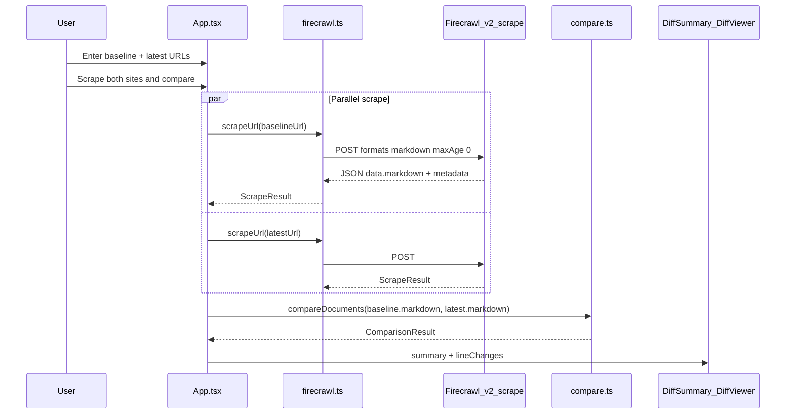

# README: How scraping and comparison work

## Goal

Replace the minimal [README.md](tax-rule-compare/README.md) with a developer-facing doc that answers:

- What you send to Firecrawl and what comes back
- Which fields the app actually uses
- How two scraped pages become a diff (no static data, no backend)

No code changes beyond README content.

---

## End-to-end flow (to include in README)




---

## Section 1: Firecrawl scrape — request format

Document the live call in [src/lib/firecrawl.ts](tax-rule-compare/src/lib/firecrawl.ts):


| Item     | Value                                            |
| -------- | ------------------------------------------------ |
| Endpoint | `POST https://api.firecrawl.dev/v2/scrape`       |
| Auth     | `Authorization: Bearer <VITE_FIRECRAWL_API_KEY>` |
| Body     | `{ url, formats: ["markdown"], maxAge: 0 }`      |


Explain briefly:

- `**formats: ["markdown"]**` — Firecrawl converts the HTML page to clean Markdown (headings, lists, tables as text). That string is what we diff; we do not diff raw HTML.
- `**maxAge: 0**` — Forces a fresh scrape on every compare (no 2-day default cache).

Include a minimal `curl` example matching the POC.

---

## Section 2: Firecrawl scrape — response format

Show the **raw API JSON** shape (simplified example):

```json
{
  "success": true,
  "data": {
    "markdown": "# Page title\n\nParagraph text...\n| Col | Col |\n...",
    "metadata": {
      "title": "Rates and thresholds ... - GOV.UK",
      "sourceURL": "https://www.gov.uk/...",
      "statusCode": 200,
      "scrapeId": "019e7374-...",
      "cacheState": "miss"
    }
  }
}
```

Note: Firecrawl can return other formats (`html`, `screenshot`, structured JSON) if requested; **this app only requests and uses `markdown`**.

---

## Section 3: App-normalized `ScrapeResult`

Document what [firecrawl.ts](tax-rule-compare/src/lib/firecrawl.ts) extracts into the app:


| Field        | Source                            | Purpose              |
| ------------ | --------------------------------- | -------------------- |
| `markdown`   | `data.markdown`                   | Input to comparison  |
| `title`      | `metadata.title`                  | UI labels            |
| `sourceUrl`  | `metadata.sourceURL`              | Proof / links        |
| `scrapeId`   | `metadata.scrapeId`               | Proves live API run  |
| `cacheState` | `metadata.cacheState`             | `hit` or `miss`      |
| `statusCode` | `metadata.statusCode`             | Reject 4xx pages     |
| `scrapedAt`  | Client `new Date().toISOString()` | When scrape finished |


Clarify: **comparison only uses the two `markdown` strings**; everything else is for display and debugging.

---

## Section 4: How comparison works

Document [src/lib/compare.ts](tax-rule-compare/src/lib/compare.ts):

### Algorithm

1. **Library:** `[diff](https://www.npmjs.com/package/diff)` — `diffLines(baselineMarkdown, latestMarkdown)`.
2. **Unit:** One line of text (split on `\n`), not words or HTML nodes.
3. **Post-process:** `pairModified()` turns adjacent remove+add chunks into `**modified`** rows (same position, different text = “latest overrides baseline”).

### Change kinds


| Kind        | Meaning                   | Client-facing label      |
| ----------- | ------------------------- | ------------------------ |
| `added`     | Line only in latest       | New in latest rules      |
| `removed`   | Line only in baseline     | Removed                  |
| `modified`  | Line changed between docs | Overridden (latest wins) |
| `unchanged` | Identical line            | Unchanged                |


### Output types

- `**ComparisonResult.lineChanges`** — Array for [DiffViewer.tsx](tax-rule-compare/src/components/DiffViewer.tsx) (unified / side-by-side / changes-only).
- `**ComparisonResult.summary`** — Counts + `highlights` + sample `modifiedPairs` for [DiffSummary.tsx](tax-rule-compare/src/components/DiffSummary.tsx).

### Highlights (rule-based, not LLM)

`buildHighlights()` scans changed lines for patterns like `£…`, `%`, tax years (`2024-to-2025`), then builds bullet points. This is **heuristic**, not an AI summary.

### Limitations (important for README)

- Line diff can misalign when pages reorder large sections.
- Navigation/footer noise in markdown may appear as “changes.”
- No semantic “same rule, different section” matching—only text line equality.

---

## Section 5: Project structure map

```
src/
  App.tsx              # Orchestrates scrape + compare + UI state
  lib/firecrawl.ts     # API client → ScrapeResult
  lib/compare.ts       # markdown A vs B → ComparisonResult
  components/
    ScrapeProof.tsx    # Scrape IDs, cache, timestamps
    ScrapedPreview.tsx # Raw markdown preview
    DiffSummary.tsx    # Stats + highlights
    DiffViewer.tsx     # Line diff views
```

---

## Section 6: Keep existing README sections (updated)

- **Quick start** — Fix wording: URLs are empty by default; user must scrape (no “pre-filled demo compare”).
- **Security** — Browser-exposed API key.
- **Build** — `npm run build` / `preview`.

Optional short link: [Firecrawl scrape docs](https://docs.firecrawl.dev/api-reference/endpoint/scrape).

---

## Deliverable

Single file update: **[tax-rule-compare/README.md](tax-rule-compare/README.md)** (~150–220 lines), structured with a table of contents:

1. Overview
2. Quick start
3. How it works (flow diagram + steps)
4. Scrape: request & response format
5. Comparison: algorithm & output types
6. Project structure
7. Limitations & next steps (e.g. LLM summary, backend proxy for API key)
8. Security & build

No application code changes unless you later ask for a separate `docs/HOW_IT_WORKS.md`; the plan keeps everything in README as requested.